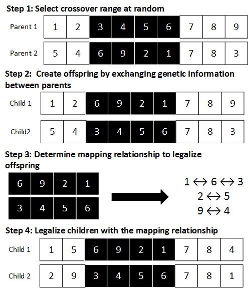

# Partially Mapped Crossover (PMX) Method

## Overview
The **Partially Mapped Crossover (PMX)** method is a **crossover technique used in genetic algorithms**, particularly effective for permutation-based problems such as the [Traveling Salesman Problem](https://github.com/ruta-tamosiunaite/miel-abeilles/). It ensures a meaningful exchange of information between parent solutions while maintaining the uniqueness of each element.  

<sub>The word "permutation" refers to the act or process of changing the linear order of an ordered set.</sub>



## Implementation
This Python implementation of PMX facilitates crossover between two parent sequences, producing offspring that are combinations of the parents while preserving the uniqueness of elements.

## Usage
Inputs:
- Two parent lists of equal length with unique elements.
- The number of children to generate (1 or 2).

Outputs:
- One or two offspring lists, each being a mix of elements from both parents.

## Functionality
1. **Crossover Range Selection**: Randomly selects a segment from each parent list for gene swapping.
2. **Offspring Creation**: Swaps the selected segments between the two parents to create two potential offspring.
3. **Duplicate Resolution**: Establishes a mapping relationship based on the swapped segments to resolve any duplicates.
4. **Offspring Legalization**: Applies the mapping to ensure all elements in each offspring are unique.

## Example
```python
parent1 = [0, 1, 2, 3, 4, 5, 6, 7, 8, 9, 0]
parent2 = [0, 5, 4, 6, 9, 2, 1, 7, 8, 3, 0]
number_of_children = 2

children = partially_mapped_crossover(parent1, parent2, number_of_children)
for child in children:
    print(child)
